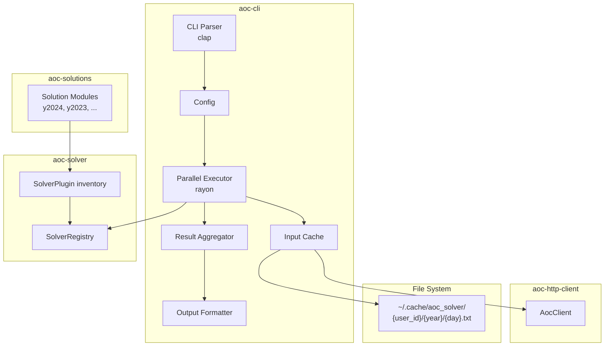

# Design Document: AOC CLI and Solutions Crates

## Overview

This design describes two new crates for the Advent of Code solver workspace:

1. **aoc-cli** - A command-line application that orchestrates solver execution with parallel processing, input caching, and optional answer submission.
2. **aoc-solutions** - A library crate containing actual puzzle solutions with automatic registration.

The CLI acts as the orchestration layer, integrating:
- `aoc-solver` for solver traits and plugin discovery
- `aoc-http-client` for fetching inputs and submitting answers
- A file-based cache for offline operation

## Architecture



## Components and Interfaces

### 1. CLI Parser (`cli.rs`)

Handles command-line argument parsing using `clap`.

```rust
use clap::{Parser, ValueEnum};
use std::path::PathBuf;

/// Parallelization level for solver execution
#[derive(Debug, Clone, Copy, Default, ValueEnum)]
pub enum ParallelizeBy {
    /// No parallelization; execute all solvers sequentially in order
    Sequential,
    /// Parallelize across years; days and parts run sequentially within each year
    Year,
    /// Parallelize across year/day combinations; parts run sequentially (default)
    #[default]
    Day,
    /// Parallelize across all year/day/part combinations
    Part,
}

#[derive(Parser, Debug)]
#[command(name = "aoc", about = "Advent of Code solver runner")]
pub struct Args {
    /// Year to run (runs all years if omitted)
    #[arg(short, long)]
    pub year: Option<u16>,
    
    /// Day to run (runs all days if omitted)
    #[arg(short, long, value_parser = clap::value_parser!(u8).range(1..=25))]
    pub day: Option<u8>,
    
    /// Part to run (runs all parts if omitted)
    #[arg(short, long, value_parser = clap::value_parser!(u8).range(1..=2))]
    pub part: Option<u8>,
    
    /// Tags to filter solvers (comma-separated)
    #[arg(short, long, value_delimiter = ',')]
    pub tags: Vec<String>,
    
    /// Cache directory for puzzle inputs
    #[arg(long, default_value = "~/.cache/aoc_solver")]
    pub cache_dir: PathBuf,
    
    /// Number of threads for parallel execution
    #[arg(long)]
    pub threads: Option<usize>,
    
    /// Parallelization level: year, day, or part
    #[arg(long, value_enum, default_value = "day")]
    pub parallelize_by: ParallelizeBy,
    
    /// Submit answers to Advent of Code
    #[arg(long)]
    pub submit: bool,
    
    /// User ID for cache organization and verification
    #[arg(long)]
    pub user_id: Option<u64>,
    
    /// Auto-retry on throttle with parsed wait time
    #[arg(long, default_value = "false")]
    pub auto_retry: bool,
    
    /// Quiet mode - only output answers
    #[arg(short, long)]
    pub quiet: bool,
}
```

### 2. Configuration (`config.rs`)

Resolves CLI args into validated runtime configuration.

```rust
use std::path::PathBuf;
use zeroize::Zeroizing;

pub struct Config {
    pub year_filter: Option<u16>,
    pub day_filter: Option<u8>,
    pub part_filter: Option<u8>,
    pub tags: Vec<String>,
    pub cache_dir: PathBuf,
    pub thread_count: usize,
    pub parallelize_by: ParallelizeBy,
    pub submit: bool,
    pub user_id: u64,
    pub session: Zeroizing<String>,
    pub auto_retry: bool,
    pub quiet: bool,
}

impl Config {
    /// Build config from CLI args, resolving session and user ID
    /// Uses blocking HTTP client for session verification
    pub fn from_args(args: Args) -> Result<Self, CliError>;
}
```

### 3. Input Cache (`cache.rs`)

File-based cache with directory structure: `{cache_dir}/{user_id}/{year}_day{day:02}.txt`

```rust
use std::path::PathBuf;

pub struct InputCache {
    base_dir: PathBuf,
    user_id: u64,
}

impl InputCache {
    pub fn new(base_dir: PathBuf, user_id: u64) -> Self;
    
    /// Get cached input or None if not cached
    pub fn get(&self, year: u16, day: u8) -> Result<Option<String>, CacheError>;
    
    /// Store input in cache
    pub fn put(&self, year: u16, day: u8, input: &str) -> Result<(), CacheError>;
    
    /// Check if input is cached
    pub fn contains(&self, year: u16, day: u8) -> bool;
    
    /// Get path for a specific year/day
    fn cache_path(&self, year: u16, day: u8) -> PathBuf {
        self.base_dir
            .join(self.user_id.to_string())
            .join(format!("{}_day{:02}.txt", year, day))
    }
}
```

### 4. Registry Extensions (changes to `aoc-solver`)

To support efficient filtering, the `aoc-solver` registry needs extensions to store and expose parts metadata.

**Storage Design: Flat `Vec<Option<SolverEntry>>` with index math**

Uses a flat vector for O(1) lookup with bounded key space (years 2015-2034, days 1-25).

```rust
/// Constants for index calculation
const BASE_YEAR: u16 = 2015;
const MAX_YEARS: usize = 20;      // 2015-2034
const DAYS_PER_YEAR: usize = 25;  // Days 1-25
const CAPACITY: usize = MAX_YEARS * DAYS_PER_YEAR;  // 500 entries

/// Metadata about a registered solver factory
#[derive(Debug, Clone, Copy)]
pub struct FactoryInfo {
    pub year: u16,
    pub day: u8,
    pub parts: u8,
}

/// Factory entry with metadata
struct SolverFactoryEntry {
    factory: SolverFactory,
    parts: u8,
}

/// Calculate index from year/day, returning None if out of bounds
fn calc_index(year: u16, day: u8) -> Option<usize> {
    // Validate year bounds
    if year < BASE_YEAR || year >= BASE_YEAR + MAX_YEARS as u16 {
        return None;
    }
    // Validate day bounds (1-25)
    if day == 0 || day > DAYS_PER_YEAR as u8 {
        return None;
    }
    let y = (year - BASE_YEAR) as usize;
    let d = (day - 1) as usize;
    Some(y * DAYS_PER_YEAR + d)
}

/// Reconstruct year/day from index
fn from_index(index: usize) -> (u16, u8) {
    let year = BASE_YEAR + (index / DAYS_PER_YEAR) as u16;
    let day = (index % DAYS_PER_YEAR) as u8 + 1;
    (year, day)
}
```

**New types and methods in `aoc-solver/src/registry.rs`:**

```rust
pub struct FactoryRegistryBuilder {
    entries: Vec<Option<SolverFactoryEntry>>,
}

impl FactoryRegistryBuilder {
    pub fn new() -> Self {
        Self {
            entries: vec![None; CAPACITY],
        }
    }
    
    /// Register a solver factory with explicit parts count
    /// Returns error if year/day is out of bounds or already registered
    pub fn register_factory<F>(
        mut self,
        year: u16,
        day: u8,
        parts: u8,
        factory: F,
    ) -> Result<Self, RegistrationError>
    where
        F: for<'a> Fn(&'a str) -> Result<Box<dyn DynSolver + 'a>, ParseError> + 'static,
    {
        let index = calc_index(year, day)
            .ok_or(RegistrationError::InvalidYearDay(year, day))?;
        
        if self.entries[index].is_some() {
            return Err(RegistrationError::DuplicateFactory(year, day));
        }
        
        self.entries[index] = Some(SolverFactoryEntry {
            factory: Box::new(factory),
            parts,
        });
        Ok(self)
    }
    
    /// Build the immutable registry
    pub fn build(self) -> SolverFactoryRegistry {
        SolverFactoryRegistry {
            storage: SolverFactoryStorage { entries: self.entries }
        }
    }
}

/// Immutable storage for solver factories with O(1) access
/// Exposes iteration and lookup methods directly
pub struct SolverFactoryStorage {
    entries: Vec<Option<SolverFactoryEntry>>,
}

impl SolverFactoryStorage {
    /// Iterate over metadata for all registered factories
    pub fn iter_info(&self) -> impl Iterator<Item = FactoryInfo> + '_ {
        self.entries.iter().enumerate().filter_map(|(i, entry)| {
            entry.as_ref().map(|e| {
                let (year, day) = from_index(i);
                FactoryInfo { year, day, parts: e.parts }
            })
        })
    }
    
    /// Get metadata for a specific factory
    pub fn get_info(&self, year: u16, day: u8) -> Option<FactoryInfo> {
        calc_index(year, day)
            .and_then(|i| self.entries[i].as_ref())
            .map(|e| FactoryInfo { year, day, parts: e.parts })
    }
    
    /// Check if a factory exists for year/day
    pub fn contains(&self, year: u16, day: u8) -> bool {
        self.get_info(year, day).is_some()
    }
    
    /// Iterate over all factories with their metadata
    pub fn iter_factories(&self) -> impl Iterator<Item = (FactoryInfo, &SolverFactory)> + '_ {
        self.entries.iter().enumerate().filter_map(|(i, entry)| {
            entry.as_ref().map(|e| {
                let (year, day) = from_index(i);
                (FactoryInfo { year, day, parts: e.parts }, &e.factory)
            })
        })
    }
}

/// Registry wrapping storage with solver creation method
pub struct SolverFactoryRegistry {
    storage: SolverFactoryStorage,
}

impl SolverFactoryRegistry {
    /// Get readonly access to the factory storage for iteration/lookup
    pub fn storage(&self) -> &SolverFactoryStorage {
        &self.storage
    }
    
    /// Create a solver instance by invoking the factory for a specific year/day
    pub fn create_solver<'a>(
        &self,
        year: u16,
        day: u8,
        input: &'a str,
    ) -> Result<Box<dyn DynSolver + 'a>, SolverError> {
        let index = calc_index(year, day)
            .ok_or(SolverError::InvalidYearDay(year, day))?;
        
        let entry = self.storage.entries[index].as_ref()
            .ok_or(SolverError::NotFound(year, day))?;
        
        (entry.factory)(input).map_err(SolverError::ParseError)
    }
}
```

**New error variants:**

```rust
#[derive(Debug, Clone, Error)]
pub enum RegistrationError {
    #[error("Duplicate factory registration for year {0} day {1}")]
    DuplicateFactory(u16, u8),
    
    #[error("Invalid year/day: year {0} day {1} (valid: 2015-2034, days 1-25)")]
    InvalidYearDay(u16, u8),
}

#[derive(Debug, Error)]
pub enum SolverError {
    #[error("Factory not found for year {0} day {1}")]
    NotFound(u16, u8),
    
    #[error("Invalid year/day: year {0} day {1} (valid: 2015-2034, days 1-25)")]
    InvalidYearDay(u16, u8),
    
    // ... existing variants
}
```

**Updated `RegisterableSolver` blanket impl:**

```rust
impl<S> RegisterableSolver for S
where
    S: Solver + Sync + 'static,
{
    fn register_with(
        &self,
        builder: FactoryRegistryBuilder,
        year: u16,
        day: u8,
    ) -> Result<FactoryRegistryBuilder, RegistrationError> {
        builder.register_factory(year, day, S::PARTS, move |input: &str| {
            let shared = S::parse(input)?;
            Ok(Box::new(SolverInstanceCow::<S>::new(year, day, shared)))
        })
    }
}
```

### 5. Parallel Executor (`executor.rs`)

Orchestrates parallel solver execution using `rayon`.

**Filtering Flow:**
1. **Tag filtering** - Applied during `RegistryBuilder::register_solver_plugins()` when building the registry
2. **Year/Day/Part filtering** - Applied in `collect_work_items()` using `registry.iter()`

**Registry Building (in main.rs or lib.rs):**
```rust
fn build_registry(tags: &[String]) -> Result<SolverFactoryRegistry, RegistrationError> {
    let builder = FactoryRegistryBuilder::new();
    
    let builder = if tags.is_empty() {
        builder.register_all_plugins()?
    } else {
        builder.register_solver_plugins(|plugin| {
            tags.iter().all(|tag| plugin.tags.contains(&tag.as_str()))
        })?
    };
    
    Ok(builder.build())
}
```

```rust
use aoc_solver::{DynSolver, SolverFactoryRegistry, FactoryInfo};
use std::sync::mpsc::Sender;

/// Work item representing a solver to execute
pub struct WorkItem {
    pub year: u16,
    pub day: u8,
    pub parts: std::ops::RangeInclusive<u8>,  // Parts to execute (e.g., 1..=2)
}

pub struct Executor {
    registry: SolverFactoryRegistry,
    cache: InputCache,
    client: Option<AocClient>,
    config: Config,
}

/// Submission outcome from AoC
#[derive(Debug, Clone)]
pub enum SubmissionOutcome {
    Correct,
    Incorrect,
    AlreadyCompleted,
    Throttled { wait_time: Option<Duration> },
    Error(String),  // Network or other submission error
}

/// Result from a single solver execution (includes submission if enabled)
pub struct SolverResult {
    pub year: u16,
    pub day: u8,
    pub part: u8,
    pub answer: Result<String, SolverError>,
    pub solve_duration: Duration,
    /// When the answer was computed
    pub solved_at: Instant,
    /// Local time when submitted (for display)
    pub submitted_at: Option<chrono::DateTime<chrono::Local>>,
    /// Submission result (if --submit enabled)
    pub submission: Option<SubmissionOutcome>,
    /// Time spent waiting for throttle retry
    pub submission_wait: Option<Duration>,
}

impl Executor {
    /// Collect work items by filtering from registry storage metadata
    fn collect_work_items(&self) -> Vec<WorkItem> {
        self.registry.storage().iter_info()
            .filter(|info| self.config.year_filter.map_or(true, |y| info.year == y))
            .filter(|info| self.config.day_filter.map_or(true, |d| info.day == d))
            .map(|info| WorkItem {
                year: info.year,
                day: info.day,
                parts: self.filter_parts(info.parts),
            })
            .collect()
    }
    
    /// Filter parts based on config.part_filter and solver's max parts
    /// Returns a range of parts to execute (empty range if filtered out)
    fn filter_parts(&self, max_parts: u8) -> std::ops::RangeInclusive<u8> {
        match self.config.part_filter {
            Some(p) if p <= max_parts => p..=p,      // Single part
            Some(_) => 1..=0,                         // Empty range (part exceeds max)
            None => 1..=max_parts,                    // All parts
        }
    }
    
    /// Execute solvers matching the filter criteria
    /// Sends results to the channel as they complete
    /// Parallelization strategy depends on config.parallelize_by
    pub fn execute(&self, tx: Sender<SolverResult>) -> Result<(), ExecutorError> {
        let work_items = self.collect_work_items();
        
        match self.config.parallelize_by {
            ParallelizeBy::Sequential => {
                // No parallelization, execute all in order
                for work in work_items {
                    let input = self.get_input(work.year, work.day)?;
                    self.run_solver(&work, &input, &tx)?;
                }
                Ok(())
            }
            ParallelizeBy::Year => {
                // Group by year using chunk_by, parallelize years, sequential within
                use itertools::Itertools;
                let by_year: Vec<Vec<WorkItem>> = work_items.into_iter()
                    .chunk_by(|w| w.year)
                    .into_iter()
                    .map(|(_, group)| group.collect())
                    .collect();
                by_year.into_par_iter().try_for_each(|items| {
                    for work in items {
                        let input = self.get_input(work.year, work.day)?;
                        self.run_solver(&work, &input, &tx)?;
                    }
                    Ok(())
                })
            }
            ParallelizeBy::Day => {
                // Parallel across year/day, sequential parts within
                work_items.par_iter().try_for_each(|work| {
                    let input = self.get_input(work.year, work.day)?;
                    self.run_solver(work, &input, &tx)
                })
            }
            ParallelizeBy::Part => {
                // Parallel across all year/day/part combinations
                work_items.par_iter().try_for_each(|work| {
                    let input = self.get_input(work.year, work.day)?;
                    self.run_solver(work, &input, &tx)
                })
            }
        }
    }
    
    /// Get input for a year/day, using cache or fetching
    fn get_input(&self, year: u16, day: u8) -> Result<String, ExecutorError>;
    
    /// Run a single solver for specified parts
    /// Solving can be parallel or sequential based on config.parallelize_by
    /// Submissions are ALWAYS sequential per day (part 1 before part 2)
    /// but submission happens in background while next part computes
    fn run_solver(
        &self,
        work: &WorkItem,
        input: &str,
        tx: &Sender<SolverResult>,
    ) -> Result<(), ExecutorError> {
        // Parts run in parallel only when parallelize_by is Part
        if matches!(self.config.parallelize_by, ParallelizeBy::Part) {
            // Parallel solving - each part gets its own solver instance
            // Use min-heap to submit in order as results arrive
            let (result_tx, result_rx) = std::sync::mpsc::channel();
            
            // Parallel solve, send results to channel
            work.parts.clone().into_par_iter().for_each_with(result_tx, |tx, part| {
                let mut solver = self.registry.create_solver(work.year, work.day, input).unwrap();
                let result = self.solve_part(work.year, work.day, part, &mut *solver);
                tx.send(result).ok();
            });
            
            // Min-heap to emit results in part order
            let mut heap: BinaryHeap<Reverse<(u8, SolverResult)>> = BinaryHeap::new();
            let mut next_part = *work.parts.start();
            
            for result in result_rx {
                heap.push(Reverse((result.part, result)));
                
                // Emit and submit results in order
                while let Some(Reverse((part, _))) = heap.peek() {
                    if *part == next_part {
                        let Reverse((_, mut result)) = heap.pop().unwrap();
                        if self.config.submit {
                            self.submit_result(&mut result);
                        }
                        tx.send(result).ok();
                        next_part += 1;
                    } else {
                        break;
                    }
                }
            }
        } else {
            // Sequential solving in background, submit in main thread
            // This allows submission of part 1 while part 2 is still solving
            let (solve_tx, solve_rx) = std::sync::mpsc::channel();
            
            // Spawn solver thread - solves parts sequentially for shared data
            let registry = self.registry.clone();
            let year = work.year;
            let day = work.day;
            let parts = work.parts.clone();
            let input = input.to_string();
            
            std::thread::spawn(move || {
                let mut solver = registry.create_solver(year, day, &input).unwrap();
                for part in parts {
                    let start = Instant::now();
                    let answer = solver.solve(part);
                    let result = SolverResult {
                        year, day, part,
                        answer: answer.map_err(Into::into),
                        solve_duration: start.elapsed(),
                        solved_at: Instant::now(),
                        submitted_at: None,
                        submission: None,
                        submission_wait: None,
                    };
                    solve_tx.send(result).ok();
                }
            });
            
            // Main thread: receive solved results and submit in order
            for mut result in solve_rx {
                if self.config.submit {
                    self.submit_result(&mut result);
                }
                tx.send(result).ok();
            }
        }
        Ok(())
    }
    
    /// Solve a single part (no submission)
    fn solve_part(
        &self,
        year: u16,
        day: u8,
        part: u8,
        solver: &mut dyn DynSolver,
    ) -> SolverResult {
        let start = Instant::now();
        let answer = solver.solve(part);
        let solve_duration = start.elapsed();
        
        SolverResult {
            year,
            day,
            part,
            answer: answer.map_err(Into::into),
            solve_duration,
            solved_at: Instant::now(),
            submitted_at: None,
            submission: None,
            submission_wait: None,
        }
    }
    
    /// Submit a result (mutates result with submission outcome)
    fn submit_result(&self, result: &mut SolverResult) {
        if let Ok(ref ans) = result.answer {
            let (outcome, wait) = self.submit_with_retry(
                result.year, result.day, result.part, ans
            );
            result.submitted_at = Some(chrono::Local::now());
            result.submission = outcome;
            result.submission_wait = wait;
        }
    }
    
    /// Submit answer with optional retry on throttle
    fn submit_with_retry(
        &self,
        year: u16,
        day: u8,
        part: u8,
        answer: &str,
    ) -> (Option<SubmissionOutcome>, Option<Duration>) {
        let client = match &self.client {
            Some(c) => c,
            None => return (Some(SubmissionOutcome::Error("No HTTP client".into())), None),
        };
        
        let mut total_wait = Duration::ZERO;
        
        loop {
            match client.submit_answer(year, day, part, answer, &self.config.session) {
                Ok(SubmissionResult::Correct) => {
                    return (Some(SubmissionOutcome::Correct), Some(total_wait));
                }
                Ok(SubmissionResult::Incorrect) => {
                    return (Some(SubmissionOutcome::Incorrect), Some(total_wait));
                }
                Ok(SubmissionResult::AlreadyCompleted) => {
                    return (Some(SubmissionOutcome::AlreadyCompleted), Some(total_wait));
                }
                Ok(SubmissionResult::Throttled { wait_time }) => {
                    if self.config.auto_retry {
                        if let Some(wait) = wait_time {
                            std::thread::sleep(wait);
                            total_wait += wait;
                            continue;  // Retry
                        }
                    }
                    return (Some(SubmissionOutcome::Throttled { wait_time }), Some(total_wait));
                }
                Err(e) => {
                    return (Some(SubmissionOutcome::Error(e.to_string())), Some(total_wait));
                }
            }
        }
    }
}
```

### 6. Result Aggregator (`aggregator.rs`)

Buffers and orders results for streaming output using two min-heaps:
- One for expected keys (what we're waiting for)
- One for received results (buffered until their turn)

```rust
use std::collections::BinaryHeap;
use std::cmp::Reverse;

/// Key for ordering results (year, day, part) - ordered ascending
#[derive(Ord, PartialOrd, Eq, PartialEq, Clone, Copy)]
pub struct ResultKey {
    pub year: u16,
    pub day: u8,
    pub part: u8,
}

impl From<&SolverResult> for ResultKey {
    fn from(r: &SolverResult) -> Self {
        Self { year: r.year, day: r.day, part: r.part }
    }
}

/// Wrapper for min-heap ordering of SolverResult
struct OrderedResult(SolverResult);

impl Ord for OrderedResult {
    fn cmp(&self, other: &Self) -> std::cmp::Ordering {
        // Reverse ordering for min-heap (smallest first)
        ResultKey::from(&other.0).cmp(&ResultKey::from(&self.0))
    }
}
impl PartialOrd for OrderedResult { /* delegate to Ord */ }
impl Eq for OrderedResult {}
impl PartialEq for OrderedResult { /* delegate to Eq */ }

pub struct ResultAggregator {
    /// Min-heap of expected keys (next to output is at top)
    expected: BinaryHeap<Reverse<ResultKey>>,
    /// Min-heap of received results waiting to be output
    pending: BinaryHeap<OrderedResult>,
}

impl ResultAggregator {
    /// Create aggregator from list of expected keys
    pub fn new(expected_keys: Vec<ResultKey>) -> Self {
        Self {
            expected: expected_keys.into_iter().map(Reverse).collect(),
            pending: BinaryHeap::new(),
        }
    }
    
    /// Add a result and return any results ready for output (in order)
    pub fn add(&mut self, result: SolverResult) -> Vec<SolverResult> {
        self.pending.push(OrderedResult(result));
        
        // Emit results while pending min matches expected min
        let mut ready = Vec::new();
        while let (Some(Reverse(next_expected)), Some(top_pending)) = 
            (self.expected.peek(), self.pending.peek()) 
        {
            if ResultKey::from(&top_pending.0) == *next_expected {
                self.expected.pop();
                ready.push(self.pending.pop().unwrap().0);
            } else {
                break;
            }
        }
        ready
    }
    
    /// Drain remaining results in order (for final output)
    pub fn drain(&mut self) -> Vec<SolverResult> {
        let mut results: Vec<_> = self.pending.drain().map(|o| o.0).collect();
        results.sort_by_key(|r| ResultKey::from(r));
        results
    }
}
```

### 7. Output Formatter (`output.rs`)

Formats and displays results.

```rust
use std::time::{Duration, Instant};

pub struct OutputFormatter {
    quiet: bool,
    /// Wall-clock start time for elapsed time calculation
    start_time: Instant,
}

impl OutputFormatter {
    pub fn new(quiet: bool) -> Self {
        Self {
            quiet,
            start_time: Instant::now(),
        }
    }
    
    /// Format and print a single result
    pub fn print_result(&self, result: &SolverResult);
    
    /// Print a summary after all results
    /// Shows both total solve time (sum of durations) and actual elapsed wall-clock time
    pub fn print_summary(&self, results: &[SolverResult]) {
        let total_solve_time: Duration = results.iter()
            .filter_map(|r| r.answer.is_ok().then_some(r.solve_duration))
            .sum();
        let elapsed_time = self.start_time.elapsed();
        
        println!("\n--- Summary ---");
        println!("Total solve time: {:?}", total_solve_time);
        println!("Elapsed wall-clock time: {:?}", elapsed_time);
        if !elapsed_time.is_zero() {
            let speedup = total_solve_time.as_secs_f64() / elapsed_time.as_secs_f64();
            println!("Speedup factor: {:.2}x", speedup);
        }
        // ... additional summary stats
    }
}
```

### 7. Error Types (`error.rs`)

Unified error handling with Arc wrapping for thread safety.

```rust
use thiserror::Error;
use thiserror_ext::AsReport;
use std::sync::Arc;

#[derive(Error, Debug)]
pub enum CliError {
    #[error("Configuration error: {0}")]
    Config(String),
    
    #[error("Cache error: {0}")]
    Cache(#[from] CacheError),
    
    #[error("HTTP client error: {0}")]
    Http(#[from] aoc_http_client::AocError),
    
    #[error("Solver error: {0}")]
    Solver(#[from] aoc_solver::SolverError),
    
    #[error("User ID mismatch: expected {expected}, got {actual}")]
    UserIdMismatch { expected: u64, actual: u64 },
    
    #[error("Session required but not provided")]
    SessionRequired,
    
    #[error("IO error: {0}")]
    Io(#[from] std::io::Error),
}

/// Arc-wrapped error for thread-safe sharing
pub type SharedCliError = Arc<CliError>;

#[derive(Error, Debug)]
pub enum CacheError {
    #[error("IO error: {0}")]
    Io(#[from] std::io::Error),
    
    #[error("Cache directory creation failed: {0}")]
    DirCreation(String),
}

#[derive(Error, Debug)]
pub enum ExecutorError {
    #[error("Input fetch failed for {year}/{day}: {source}")]
    InputFetch {
        year: u16,
        day: u8,
        #[source]
        source: Box<dyn std::error::Error + Send + Sync>,
    },
    
    #[error("Solver execution failed: {0}")]
    Solver(#[from] aoc_solver::SolverError),
}
```

### 8. Solutions Crate Structure (`aoc-solutions`)

```
aoc-solutions/
├── Cargo.toml
└── src/
    ├── lib.rs
    ├── y2024/
    │   ├── mod.rs
    │   ├── day01.rs
    │   ├── day02.rs
    │   └── ...
    └── y2023/
        ├── mod.rs
        └── ...
```

Example solution:

```rust
// aoc-solutions/src/y2024/day01.rs
use aoc_solver::{AocParser, AutoRegisterSolver, ParseError, SolveError, Solver};
use std::borrow::Cow;

#[derive(AutoRegisterSolver)]
#[aoc(year = 2024, day = 1, tags = ["2024", "easy"])]
pub struct Day01;

impl AocParser for Day01 {
    type SharedData = Vec<i32>;
    
    fn parse(input: &str) -> Result<Cow<'_, Self::SharedData>, ParseError> {
        input
            .lines()
            .map(|l| l.parse().map_err(|_| ParseError::InvalidFormat("expected i32".into())))
            .collect::<Result<Vec<_>, _>>()
            .map(Cow::Owned)
    }
}

impl Solver for Day01 {
    const PARTS: u8 = 2;
    
    fn solve_part(shared: &mut Cow<'_, Self::SharedData>, part: u8) -> Result<String, SolveError> {
        match part {
            1 => Ok(shared.iter().sum::<i32>().to_string()),
            2 => Ok(shared.iter().max().unwrap_or(&0).to_string()),
            _ => Err(SolveError::PartNotImplemented(part)),
        }
    }
}
```

## Data Models

### Time Handling Convention

- `std::time::Instant` - for internal timing measurements (monotonic, not affected by system clock changes)
- `std::time::Duration` - for time intervals (solve duration, wait times)
- `chrono::DateTime<chrono::Local>` - only for user-facing timestamps that need to be displayed (e.g., submission time)

### SolverResult

```rust
use std::time::{Duration, Instant};

/// Result from a single solver execution (includes submission if enabled)
pub struct SolverResult {
    pub year: u16,
    pub day: u8,
    pub part: u8,
    pub answer: Result<String, SolverError>,
    /// Time taken to solve (std::time::Duration)
    pub solve_duration: Duration,
    /// When the answer was computed (std::time::Instant for internal ordering)
    pub solved_at: Instant,
    /// Local time when submitted (chrono for user-facing display, e.g., "14:32:05")
    pub submitted_at: Option<chrono::DateTime<chrono::Local>>,
    /// Submission result (if --submit enabled)
    pub submission: Option<SubmissionOutcome>,
    /// Time spent waiting for throttle retry (std::time::Duration)
    pub submission_wait: Option<Duration>,
}
```

### ResultKey (for ordering)

```rust
#[derive(Ord, PartialOrd, Eq, PartialEq, Clone, Copy)]
pub struct ResultKey {
    pub year: u16,
    pub day: u8,
    pub part: u8,
}
```

### SubmissionOutcome

```rust
#[derive(Debug, Clone)]
pub enum SubmissionOutcome {
    Correct,
    Incorrect,
    AlreadyCompleted,
    Throttled { wait_time: Option<Duration> },
    Error(String),  // Network or other submission error
}
```

Note: `submission: Option<SubmissionOutcome>` - `None` means `--submit` was not enabled.


## Correctness Properties

*A property is a characteristic or behavior that should hold true across all valid executions of a system-essentially, a formal statement about what the system should do. Properties serve as the bridge between human-readable specifications and machine-verifiable correctness guarantees.*

### Property 1: Filter Matching

*For any* set of registered solvers and any combination of year/day/part/tag filters, the filtered result SHALL contain exactly those solvers that match ALL specified criteria, and SHALL contain all solvers when no criteria are specified.

**Validates: Requirements 1.1, 1.2, 1.5**

### Property 2: Cache Path Construction

*For any* valid user_id, year, and day values, the cache path SHALL be constructed as `{cache_dir}/{user_id}/{year}_day{day:02}.txt` where cache_dir is the configured cache directory.

**Validates: Requirements 1.3, 2.4**

### Property 3: Cache Hit Returns Cached Data

*For any* cached input, when the cache contains data for a year/day combination, retrieving that input SHALL return the exact cached content without modification.

**Validates: Requirements 2.2**

### Property 4: User ID Verification

*For any* session key and provided user_id, if the session's actual user_id differs from the provided user_id, the CLI SHALL return a UserIdMismatch error containing both the expected and actual values.

**Validates: Requirements 3.4, 3.5**

### Property 5: Submission Result Handling

*For any* submission result type (Correct, Incorrect, AlreadyCompleted, Throttled), the CLI SHALL produce a distinct, non-empty output message that identifies the result type.

**Validates: Requirements 5.2**

### Property 6: Error Message Formatting

*For any* CliError variant, the Display implementation SHALL produce a non-empty, human-readable message.

**Validates: Requirements 6.3**

### Property 7: Error Aggregation

*For any* set of solver executions where multiple solvers fail, the CLI SHALL collect and report all failures, and the count of reported errors SHALL equal the count of failed solvers.

**Validates: Requirements 6.4**

### Property 8: Result Output Formatting

*For any* SolverResult (success or failure), the formatted output SHALL contain the year, day, part, and either the answer or error message.

**Validates: Requirements 8.1, 8.2, 8.3**

### Property 9: Quiet Mode Output

*For any* SolverResult in quiet mode, the output SHALL contain only the answer (or error) without year/day/part labels or timing information.

**Validates: Requirements 8.4**

### Property 10: Summary Timing Accuracy

*For any* set of SolverResults, the summary SHALL display both total solve time (sum of all solve_duration values) and elapsed wall-clock time, where elapsed time is less than or equal to total solve time when parallelization is used.

**Validates: Requirements 8.5**

### Property 11: Result Ordering

*For any* sequence of SolverResults added to the aggregator in any order, the output sequence SHALL be sorted by (year, day, part) in ascending order.

**Validates: Requirements 9.1, 9.2, 9.3, 9.4, 9.5**

### Property 12: Parallelization Level Behavior

*For any* parallelization level (sequential, year, day, or part), the execution SHALL respect the specified granularity: sequential executes all in order, year-level parallelizes only across years, day-level parallelizes across year/day combinations, and part-level parallelizes across all year/day/part combinations.

**Validates: Requirements 4.1, 4.2, 4.3, 4.4, 4.5**

## Error Handling

### Error Categories

1. **Configuration Errors** - Invalid CLI arguments, missing required options
2. **Cache Errors** - File I/O failures, permission issues
3. **Network Errors** - HTTP failures, timeouts (wrapped from aoc-http-client)
4. **Solver Errors** - Parse failures, solve failures (wrapped from aoc-solver)
5. **Validation Errors** - User ID mismatch, session verification failures

### Error Propagation Strategy

- Use `thiserror` for all error type definitions
- Use `thiserror-ext` for `Arc<CliError>` to enable thread-safe error sharing
- Errors from parallel execution are collected, not short-circuited
- All errors include context (year/day when applicable)

### User-Facing Error Messages

```
Error: User ID mismatch: expected 12345, got 67890
Error: Failed to fetch input for 2024/01: HTTP 404 Not Found
Error: Solver 2024/01 part 1 failed: Invalid format: expected integer
Error: Cache write failed for 2024/01: Permission denied
```

## Testing Strategy

### Property-Based Testing

The CLI crate will use `proptest` for property-based testing with 10 iterations per property to minimize compile time.

```toml
[dev-dependencies]
proptest = { version = "1.5", optional = true }

[features]
test = ["proptest"]
```

Each property test will be annotated with the format:
```rust
// **Feature: aoc-cli-and-solutions, Property N: Property Name**
// **Validates: Requirements X.Y**
```

### Unit Tests

Unit tests will cover:
- CLI argument parsing edge cases
- Cache path construction
- Result aggregator ordering logic
- Output formatting for all result types

### Integration Tests

Integration tests (optional, marked with `#[ignore]`) will cover:
- End-to-end solver execution with mock inputs
- Cache read/write cycles
- Submission flow with mock HTTP responses

## Dependencies

### aoc-cli

```toml
[dependencies]
aoc-solver = { path = "../aoc-solver" }
aoc-http-client = { path = "../aoc-http-client" }
clap = { version = "4.5", features = ["derive"] }
rayon = "1.10"
itertools = "0.13"
thiserror = "2.0"
thiserror-ext = "0.2"
zeroize = "1.8"
dirs = "5.0"
rpassword = "7.3"
chrono = "0.4"

[dev-dependencies]
proptest = { version = "1.5", optional = true }
tempfile = "3.14"

[features]
test = ["proptest"]
```

### aoc-solutions

```toml
[dependencies]
aoc-solver = { path = "../aoc-solver" }

[dev-dependencies]
proptest = { version = "1.5", optional = true }

[features]
test = ["proptest"]
```
