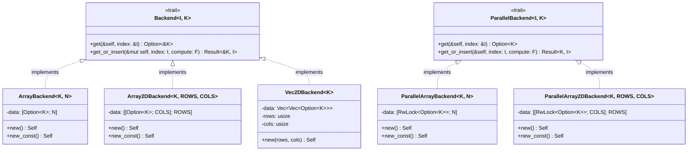

# Design Document: Array DP Backends

## Overview

This feature extends the DP cache system with fixed-size array-based backends that leverage Rust's const generics. These backends provide:

1. **ArrayBackend<K, N>**: 1D fixed-size array with const generic size
2. **Array2DBackend<K, ROWS, COLS>**: 2D fixed-size array with const generic dimensions
3. **Vec2DBackend<K>**: 2D Vec-based backend for runtime-sized dimensions
4. **ParallelArrayBackend<K, N>**: Thread-safe 1D array backend
5. **ParallelArray2DBackend<K, ROWS, COLS>**: Thread-safe 2D array backend

Additionally, the existing `VecBackend` will be updated to use `OnceCell` for consistency with the new backends.

All array backends support const construction for compile-time initialization, enabling zero-allocation caching patterns.

## Architecture



## Components and Interfaces

### ArrayBackend<K, N>

A 1D fixed-size array backend using const generics and `OnceCell` for each element.

```rust
pub struct ArrayBackend<K, const N: usize> {
    data: [OnceCell<K>; N],
}

impl<K, const N: usize> ArrayBackend<K, N> {
    /// Creates a new ArrayBackend with all elements uninitialized.
    /// This is a const fn, usable in const/static contexts.
    pub const fn new() -> Self {
        Self { data: [const { OnceCell::new() }; N] }  // Rust 1.79+ inline const
    }
}

impl<K, const N: usize> Backend<usize, K> for ArrayBackend<K, N> {
    fn get(&self, index: &usize) -> Option<&K>;
    fn get_or_insert<F>(&mut self, index: usize, compute: F) -> Result<&K, usize>;
}
```

### Array2DBackend<K, ROWS, COLS>

A 2D fixed-size array backend using const generics and `OnceCell` for each element.

```rust
pub struct Array2DBackend<K, const ROWS: usize, const COLS: usize> {
    data: [[OnceCell<K>; COLS]; ROWS],
}

impl<K, const ROWS: usize, const COLS: usize> Array2DBackend<K, ROWS, COLS> {
    /// Creates a new Array2DBackend with all elements uninitialized.
    /// This is a const fn, usable in const/static contexts.
    pub const fn new() -> Self {
        Self { data: [[const { OnceCell::new() }; COLS]; ROWS] }
    }
}

impl<K, const ROWS: usize, const COLS: usize> Backend<(usize, usize), K> 
    for Array2DBackend<K, ROWS, COLS> 
{
    fn get(&self, index: &(usize, usize)) -> Option<&K>;
    fn get_or_insert<F>(&mut self, index: (usize, usize), compute: F) -> Result<&K, (usize, usize)>;
}
```

### Vec2DBackend<K>

A 2D Vec-based backend for runtime-sized dimensions, using `OnceCell` for each element.

```rust
pub struct Vec2DBackend<K> {
    data: Vec<Vec<OnceCell<K>>>,
    rows: usize,
    cols: usize,
}

impl<K> Vec2DBackend<K> {
    /// Creates a new Vec2DBackend with the specified dimensions.
    pub fn new(rows: usize, cols: usize) -> Self;
}

impl<K> Backend<(usize, usize), K> for Vec2DBackend<K> {
    fn get(&self, index: &(usize, usize)) -> Option<&K>;
    fn get_or_insert<F>(&mut self, index: (usize, usize), compute: F) -> Result<&K, (usize, usize)>;
}
```

### ParallelArrayBackend<K, N>

A thread-safe 1D array backend using `OnceLock` per element. `OnceLock` is ideal for DP caches because:
- It's designed for "write once, read many" patterns
- Built-in `get_or_init` handles race conditions correctly (only one thread computes)
- Lower overhead than `RwLock<Option<K>>` - no Option wrapper needed
- Once initialized, reads are lock-free

```rust
pub struct ParallelArrayBackend<K, const N: usize> {
    data: [OnceLock<K>; N],
}

impl<K, const N: usize> ParallelArrayBackend<K, N> {
    /// Creates a new ParallelArrayBackend with all elements uninitialized.
    /// This is a const fn, usable in const/static contexts.
    pub const fn new() -> Self {
        Self { data: [const { OnceLock::new() }; N] }
    }
}

impl<K, const N: usize> ParallelBackend<usize, K> for ParallelArrayBackend<K, N>
where
    K: Clone + Send + Sync,
{
    fn get(&self, index: &usize) -> Option<K>;
    fn get_or_insert<F>(&self, index: usize, compute: F) -> Result<K, usize>;
}
```

### ParallelArray2DBackend<K, ROWS, COLS>

A thread-safe 2D array backend using `OnceLock` per element.

```rust
pub struct ParallelArray2DBackend<K, const ROWS: usize, const COLS: usize> {
    data: [[OnceLock<K>; COLS]; ROWS],
}

impl<K, const ROWS: usize, const COLS: usize> ParallelArray2DBackend<K, ROWS, COLS> {
    /// Creates a new ParallelArray2DBackend with all elements uninitialized.
    /// This is a const fn, usable in const/static contexts.
    pub const fn new() -> Self {
        Self { data: [[const { OnceLock::new() }; COLS]; ROWS] }
    }
}

impl<K, const ROWS: usize, const COLS: usize> ParallelBackend<(usize, usize), K> 
    for ParallelArray2DBackend<K, ROWS, COLS>
where
    K: Clone + Send + Sync,
{
    fn get(&self, index: &(usize, usize)) -> Option<K>;
    fn get_or_insert<F>(&self, index: (usize, usize), compute: F) -> Result<K, (usize, usize)>;
}
```

## Data Models

### Index Types

- **1D backends**: Use `usize` as the index type
- **2D backends**: Use `(usize, usize)` as the index type (row, col)

### Storage Layout

- **ArrayBackend**: `[OnceCell<K>; N]` - contiguous memory, cache-friendly, single-threaded
- **Array2DBackend**: `[[OnceCell<K>; COLS]; ROWS]` - row-major layout, single-threaded
- **Vec2DBackend**: `Vec<Vec<OnceCell<K>>>` - heap-allocated, row-major, single-threaded
- **ParallelArrayBackend**: `[OnceLock<K>; N]` - per-element OnceLock, lock-free reads after init
- **ParallelArray2DBackend**: `[[OnceLock<K>; COLS]; ROWS]` - per-element OnceLock, lock-free reads after init

### OnceCell vs OnceLock

- **OnceCell** (`std::cell::OnceCell`): Single-threaded, used for sequential backends
- **OnceLock** (`std::sync::OnceLock`): Thread-safe, used for parallel backends
- Both provide `get_or_init` for exactly-once initialization
- Both support const construction via `const fn new()`

### VecBackend Update

The existing `VecBackend` will be updated from `Vec<Option<K>>` to `Vec<OnceCell<K>>` for consistency:

```rust
// Before
pub struct VecBackend<K> {
    data: Vec<Option<K>>,
}

// After
pub struct VecBackend<K> {
    data: Vec<OnceCell<K>>,
}
```

This change is backward-compatible as the `Backend` trait interface remains unchanged.

## Correctness Invariants

The following invariants must hold for all array backends:

1. **Uninitialized returns None**: `get` on an uninitialized index returns `None`
2. **Exactly-once computation**: `get_or_insert` computes the value exactly once per index
3. **Bounds checking**: Out-of-bounds access returns `Err(index)`
4. **Thread safety (parallel)**: Concurrent `get_or_insert` calls compute exactly once
5. **Const construction**: `new_const()` produces equivalent behavior to `new()`

These invariants are verified through unit tests.

## Error Handling

### Bounds Checking

All array backends perform bounds checking and return `Err(index)` for out-of-bounds access:

```rust
// 1D bounds check
if index >= N {
    return Err(index);
}

// 2D bounds check
if row >= ROWS || col >= COLS {
    return Err((row, col));
}
```

### OnceLock Behavior (Parallel Backends)

Parallel backends use `OnceLock` which provides:
- **No poisoning**: Unlike `RwLock`, `OnceLock` doesn't poison on panic
- **Exactly-once initialization**: `get_or_init` guarantees the closure runs exactly once
- **Lock-free reads**: After initialization, `get` is a simple atomic load
- Uses `std::sync::OnceLock` (stable since Rust 1.70)

## Testing Strategy

### Unit Tests Only

Following the pattern of other utils in aoc-solutions, this feature uses unit tests only (no property-based testing).

### Unit Test Coverage

**ArrayBackend tests:**
- `get` returns `None` for uninitialized indices
- `get_or_insert` computes and stores value correctly
- `get_or_insert` returns existing value without recomputing
- Out-of-bounds access returns error with correct index
- Const construction works correctly

**Array2DBackend tests:**
- Same coverage as ArrayBackend for 2D indices
- Row and column bounds checked independently

**Vec2DBackend tests:**
- Same coverage as Array2DBackend
- Runtime dimension specification works correctly

**ParallelArrayBackend tests:**
- Same coverage as ArrayBackend
- Concurrent access from multiple threads works correctly
- Compute function called exactly once per index under contention

**ParallelArray2DBackend tests:**
- Same coverage as ParallelArrayBackend for 2D indices

**Integration tests:**
- DpCache builder accepts new backends
- ParallelDpCache builder accepts new parallel backends
- End-to-end DP computation with array backends
