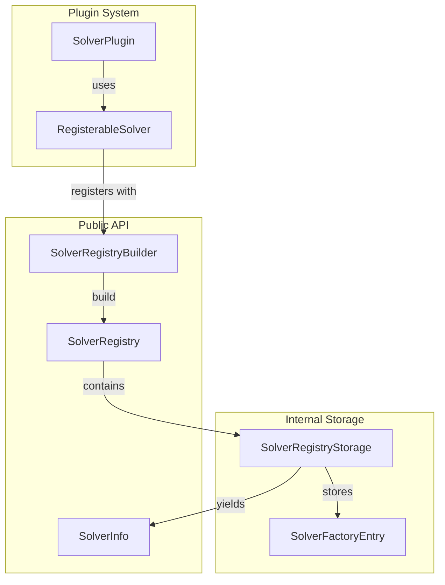

# Design Document: Unified Solver Registry

## Overview

This design consolidates the dual registry system (`SolverRegistry`/`RegistryBuilder` and `SolverFactoryRegistry`/`FactoryRegistryBuilder`) into a single unified implementation. The new design uses:

- `SolverRegistry` - The single registry type for managing and creating solvers
- `SolverRegistryBuilder` - Builder pattern for constructing registries
- `SolverRegistryStorage` - Internal flat Vec storage for efficient year/day indexing
- `SolverFactory` - Thread-safe factory type (always Send + Sync)
- `SolverInfo` - Metadata about registered solvers
- `RegisterableSolver` - Unified trait for self-registration

The key insight is that the newer `SolverFactoryRegistry` implementation with flat Vec storage is superior to the HashMap-based `SolverRegistry`, so we adopt that approach while keeping the simpler `SolverRegistry` name.

## Architecture



### Storage Layout

The storage uses a flat `Vec<Option<SolverFactoryEntry>>` with capacity for 20 years × 25 days = 500 entries. Index calculation:

```
index = (year - 2015) * 25 + (day - 1)
```

This provides O(1) lookup and maintains ordering for iteration.

## Components and Interfaces

### SolverRegistryStorage

Internal storage component:

```rust
pub struct SolverRegistryStorage {
    entries: Vec<Option<SolverFactoryEntry>>,
}

struct SolverFactoryEntry {
    factory: SolverFactory,
    parts: u8,
}

impl SolverRegistryStorage {
    pub fn iter_info(&self) -> impl Iterator<Item = SolverInfo> + '_;
    pub fn get_info(&self, year: u16, day: u8) -> Option<SolverInfo>;
    pub fn contains(&self, year: u16, day: u8) -> bool;
    pub fn iter_factories(&self) -> impl Iterator<Item = (SolverInfo, &SolverFactory)> + '_;
    pub fn len(&self) -> usize;
    pub fn is_empty(&self) -> bool;
}
```

### SolverRegistryBuilder

Builder for constructing registries (consolidates both old builders):

```rust
pub struct SolverRegistryBuilder {
    entries: Vec<Option<SolverFactoryEntry>>,
}

impl SolverRegistryBuilder {
    pub fn new() -> Self;
    
    // Primary registration method with parts metadata
    pub fn register_factory<F>(
        &mut self,
        year: u16,
        day: u8,
        parts: u8,
        factory: F,
    ) -> Result<&mut Self, RegistrationError>;
    
    // Legacy registration (defaults to 2 parts)
    pub fn register<F>(
        &mut self,
        year: u16,
        day: u8,
        factory: F,
    ) -> Result<&mut Self, RegistrationError>;
    
    // Plugin registration
    pub fn register_all_plugins(&mut self) -> Result<&mut Self, RegistrationError>;
    pub fn register_solver_plugins<F>(&mut self, filter: F) -> Result<&mut Self, RegistrationError>;
    
    pub fn build(self) -> SolverRegistry;
}
```

### SolverRegistry

The unified registry (replaces both old registry types):

```rust
pub struct SolverRegistry {
    storage: SolverRegistryStorage,
}

impl SolverRegistry {
    pub fn storage(&self) -> &SolverRegistryStorage;
    
    pub fn create_solver<'a>(
        &self,
        year: u16,
        day: u8,
        input: &'a str,
    ) -> Result<Box<dyn DynSolver + 'a>, SolverError>;
}
```

### Traits

Unified trait for solver registration (consolidates `RegisterableSolver` and `RegisterableFactory`):

```rust
// For type-erased solver registration with parts metadata
pub trait RegisterableSolver: Sync {
    fn register_with<'a>(
        &self,
        builder: &'a mut SolverRegistryBuilder,
        year: u16,
        day: u8,
    ) -> Result<&'a mut SolverRegistryBuilder, RegistrationError>;
    
    fn parts(&self) -> u8;
}
```

## Data Models

### SolverInfo

Metadata about a registered solver (renamed from `FactoryInfo`):

```rust
#[derive(Debug, Clone, Copy, PartialEq, Eq)]
pub struct SolverInfo {
    pub year: u16,
    pub day: u8,
    pub parts: u8,
}
```

### Factory Type

Single thread-safe factory type (consolidates `SolverFactory` and `SolverFactorySync`):

```rust
pub type SolverFactory = Box<dyn for<'a> Fn(&'a str) -> Result<Box<dyn DynSolver + 'a>, ParseError> + Send + Sync>;
```

### Constants

```rust
pub const BASE_YEAR: u16 = 2015;
pub const MAX_YEARS: usize = 20;
pub const DAYS_PER_YEAR: usize = 25;
pub const CAPACITY: usize = MAX_YEARS * DAYS_PER_YEAR;
```


## Correctness Properties

*A property is a characteristic or behavior that should hold true across all valid executions of a system-essentially, a formal statement about what the system should do. Properties serve as the bridge between human-readable specifications and machine-verifiable correctness guarantees.*

### Property 1: Registration preserves factory metadata

*For any* valid year (2015-2034), day (1-25), and parts count, when a factory is registered with `register_factory()`, the resulting registry's storage SHALL contain a `SolverInfo` with matching year, day, and parts values.

**Validates: Requirements 2.2**

### Property 2: Duplicate registration fails

*For any* year/day combination, registering a factory twice SHALL return `RegistrationError::DuplicateSolverFactory` on the second attempt, and the original factory SHALL remain unchanged.

**Validates: Requirements 2.3**

### Property 3: Out-of-bounds registration fails

*For any* year outside 2015-2034 or day outside 1-25, calling `register_factory()` SHALL return `RegistrationError::InvalidYearDay`.

**Validates: Requirements 2.4**

### Property 4: Iteration ordering

*For any* set of registered factories, `iter_info()` SHALL yield `SolverInfo` items in strictly ascending (year, day) lexicographic order.

**Validates: Requirements 3.2**

### Property 5: Lookup consistency

*For any* year/day combination, `get_info(year, day)` returns `Some(SolverInfo)` if and only if `contains(year, day)` returns `true`, and the returned `SolverInfo` SHALL have matching year and day fields.

**Validates: Requirements 3.3, 3.4**

### Property 6: Count consistency

*For any* registry built from N successful `register_factory()` calls, `storage().len()` SHALL equal N, and `storage().is_empty()` SHALL equal (N == 0).

**Validates: Requirements 3.5, 3.6**

### Property 7: Solver creation invokes factory

*For any* registered factory and input string, `create_solver(year, day, input)` SHALL invoke the factory with the input and return the resulting solver.

**Validates: Requirements 4.1**

### Property 8: Unregistered solver returns NotFound

*For any* valid but unregistered year/day combination, `create_solver()` SHALL return `SolverError::NotFound(year, day)`.

**Validates: Requirements 4.2**

### Property 9: Out-of-bounds solver creation fails

*For any* year outside 2015-2034 or day outside 1-25, `create_solver()` SHALL return `SolverError::InvalidYearDay(year, day)`.

**Validates: Requirements 4.3**

### Property 10: Parse errors are wrapped

*For any* factory that returns `ParseError`, `create_solver()` SHALL return `SolverError::ParseError` containing the original error.

**Validates: Requirements 4.4**

## Error Handling

### Registration Errors

```rust
pub enum RegistrationError {
    DuplicateSolverFactory(u16, u8),  // Duplicate factory registration
    InvalidYearDay(u16, u8),          // Year/day out of bounds
}
```

### Solver Errors

```rust
pub enum SolverError {
    NotFound(u16, u8),             // No factory registered
    InvalidYearDay(u16, u8),       // Year/day out of bounds
    ParseError(ParseError),        // Factory returned parse error
    SolveError(SolveError),        // Solver returned solve error
}
```

## Testing Strategy

### Property-Based Testing

Use the `proptest` crate for property-based testing. Each property test should run a minimum of 100 iterations.

**Test file:** `aoc-solver/tests/registry_properties.rs`

Properties to implement:
1. Registration preserves metadata (Property 1)
2. Duplicate registration fails (Property 2)
3. Out-of-bounds registration fails (Property 3)
4. Iteration ordering (Property 4)
5. Lookup consistency (Property 5)
6. Count consistency (Property 6)
7. Solver creation invokes factory (Property 7)
8. Unregistered solver returns NotFound (Property 8)
9. Out-of-bounds solver creation fails (Property 9)
10. Parse errors are wrapped (Property 10)

### Unit Tests

Unit tests for specific examples and edge cases:

1. Empty registry behavior
2. Single registration
3. Boundary values (year 2015, 2034; day 1, 25)
4. Plugin system integration
5. Macro compatibility

### Test Generators

```rust
// Valid year generator: 2015..=2034
fn arb_valid_year() -> impl Strategy<Value = u16> {
    (2015u16..=2034u16)
}

// Valid day generator: 1..=25
fn arb_valid_day() -> impl Strategy<Value = u8> {
    (1u8..=25u8)
}

// Invalid year generator
fn arb_invalid_year() -> impl Strategy<Value = u16> {
    prop_oneof![
        (0u16..2015u16),
        (2035u16..=u16::MAX),
    ]
}

// Invalid day generator
fn arb_invalid_day() -> impl Strategy<Value = u8> {
    prop_oneof![
        Just(0u8),
        (26u8..=u8::MAX),
    ]
}

// Parts count generator: 1..=2 (standard AoC)
fn arb_parts() -> impl Strategy<Value = u8> {
    (1u8..=2u8)
}
```
